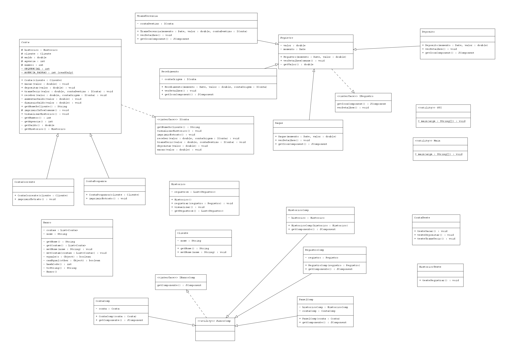

# Desafio-Java-Dio-TQI-Bootcamp
Desafio de Projeto de OO com Java do **Bootcamp da TQI**, na **DIO**.

Uma aplicação simples, feita com **Java**, **Lombok** e **POO** de um banco virtual.

A ideia era ter só as classes de conta poupança e conta corrente com os métodos de sacar, depositar, transferir, com a opção também de imprimir extrato. Mas eu quis criar um mecanismo de histórico para registrar estas ações nas contas porque seria bem intuitivo de se implementar e tornaria a ideia desse programa bem mais interessante.

# Confira o diagrama de classes

Sintam-se livres para contribuir e/ou dar feedback.
